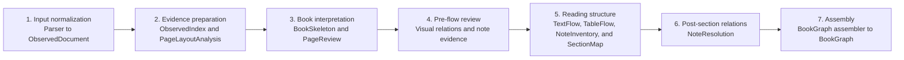

# inkline

Composable document parsing, canonical representation, EPUB export, and RAG pipelines.

The pipeline is centered on parser-neutral canonical contracts. The authoritative
[architecture dependency graph and current canonical-v2 runtime sequence](docs/architecture.md)
are documented separately so planned dependencies are not confused with code that
already runs. The current release path still uses `canonical.json` for EPUB and RAG;
BookGraph remains the pre-release migration path.

The target BookGraph path is an explicit artifact DAG rather than a collection of
isolated rebuilds or a mutable linear document. The overview deliberately shows only
stage order; the architecture document contains the authoritative per-artifact input
and output table.



Each stage consumes named upstream artifacts, validates its output, and may be
materialized for golden review or resume. Final TextFlow is built once, after
VisualRelationReview and note-marker review have supplied validated caption and note
evidence. SectionMap then consumes that TextFlow together with TableFlow,
VisualRelationReview, and NoteInventory. The current implementation has only the
TextFlow foundation and in-progress TableFlow/SectionMap path; it has not reached this
revised target. The release EPUB/RAG path and legacy BookGraph projections have not
yet been switched to the artifact bundle.

The new pre-SectionMap boundaries are documented in
[the frozen BookGraph upstream artifact contracts](docs/bookgraph-upstream-artifact-contracts.md),
[VisualRelationReview before TextFlow](docs/visual-relation-review-design.md),
[note processing before and after SectionMap](docs/note-processing-design.md), and
[the revised implementation plan](docs/section-map-upstream-replan.md).

Pre-release artifact schemas may use temporary `0.x-shadow` versions and change
incompatibly; development artifacts and goldens are regenerated instead of migrated.
The first release will freeze one release schema version, and later compatibility work
will occur at release boundaries. See [the architecture document](docs/architecture.md)
for the target DAG and the separately documented current runtime.

## Layout

| Path | Responsibility |
| --- | --- |
| [packages/inkline-canonical](packages/inkline-canonical/README.md) | Stable document contract, parser-neutral shadow contracts, validation, and IO. |
| [packages/inkline-parse](packages/inkline-parse/README.md) | Parser protocol, registry, parser run state, and non-PDF importers. |
| `packages/inkline-workflow` (planned) | Framework-neutral canonical DAG scheduling, artifact materialization, and resume policy. |
| [packages/inkline-parser-mineru](packages/inkline-parser-mineru/README.md) | MinerU adapter, raw artifact loading, MinerU normalization, and parser-specific repairs. |
| [packages/inkline-epub](packages/inkline-epub/README.md) | `CanonicalDocument` to reflowable EPUB rendering. |
| [packages/inkline-rag](packages/inkline-rag/README.md) | Canonical chunking, embeddings, FAISS indexing, and search. |
| [packages/inkline-llm](packages/inkline-llm/README.md) | Shared local LLM/Ollama client defaults and request helpers. |
| [packages/inkline-cli](packages/inkline-cli/README.md) | Unified `inkline` command-line interface. |
| [docs](docs/) | Cross-package architecture notes, canonical design records, and phase plans. |
| [tests](tests/) | Cross-package smoke, contract, and regression tests. |

The root README is intentionally a project map. Package internals belong in the
package README, while cross-package architecture decisions belong in `docs/`.

Sequential tasks that span multiple Codex sessions follow the tracked
[cross-session handoff workflow](docs/development/session-handoff-workflow.md).
Each completed session records factual state and generates the immediately following
session's prompt from the templates in [`docs/templates`](docs/templates/). Generated
handoffs remain local under `docs/handovers/session-handoffs/`.

## Quick Start

Install the workspace and run tests from the repository root:

```bash
uv sync
uv run python -m pytest -q
```

Install the optional MinerU adapter and its runtime before parsing PDFs:

```bash
uv sync --extra mineru
uv run inkline ingest pdf input.pdf --parser mineru --output data/outputs/sample/canonical.json
uv run inkline export epub data/outputs/sample/canonical.json --output data/outputs/sample/book.epub
uv run inkline rag chunk data/outputs/sample/canonical.json --output data/outputs/sample/chunks.jsonl
```

During BookGraph shadow development, `inkline ingest pdf` can also write parser-neutral
ObservedDocument and observed BookGraph artifacts:

```bash
uv run --extra mineru inkline ingest pdf data/samples/丝绸之路新史.pdf \
  --parser mineru \
  --output data/outputs/丝绸之路新史/canonical.json \
  --observed-output data/outputs/丝绸之路新史/observed_document.json \
  --bookgraph-from-observed-output data/outputs/丝绸之路新史/canonical_v2_observed.json \
  --internal-canonical-output data/outputs/丝绸之路新史/internal_canonical.json \
  --book-skeleton-output data/outputs/丝绸之路新史/book_skeleton.json
```

MinerU ingestion keeps Qwen visual marker repair disabled by default. Enable it
with `--marker-locator-repair`; it uses `qwen3.6:35b-a3b` at 150 DPI for full
pages and 200 DPI for paragraph-block retries. The shared Ollama/Qwen client
lives in `inkline-llm`, which owns the default model and Ollama endpoint
constants; marker-locator prompts, evidence files, and note writeback rules stay
inside `inkline-parser-mineru`.

To reuse existing MinerU raw outputs without rerunning MinerU, call the
parser-specific `mineru-to-canonical` command directly and pass the raw files:

```bash
uv run --extra mineru mineru-to-canonical \
  --content-list-v2 data/outputs/丝绸之路新史/mineru_raw/丝绸之路新史/vlm/丝绸之路新史_content_list_v2.json \
  --middle data/outputs/丝绸之路新史/mineru_raw/丝绸之路新史/vlm/丝绸之路新史_middle.json \
  --model data/outputs/丝绸之路新史/mineru_raw/丝绸之路新史/vlm/丝绸之路新史_model.json \
  --md data/outputs/丝绸之路新史/mineru_raw/丝绸之路新史/vlm/丝绸之路新史.md \
  --source-pdf data/samples/丝绸之路新史.pdf \
  --doc-id 丝绸之路新史 \
  --title 丝绸之路新史 \
  --marker-locator-repair \
  --output data/outputs/丝绸之路新史/canonical.json \
  --bookgraph-output data/outputs/丝绸之路新史/canonical_v2.json
```

`--source-pdf` is required when `--marker-locator-repair` is enabled because the
Qwen locator renders PDF pages for visual marker evidence. Marker evidence and
timing logs default to a sibling directory named after the output stem, such as
`data/outputs/丝绸之路新史/canonical_qwen_marker_locator/`.

`canonical_v2.json` is a pre-release BookGraph shadow artifact. It validates the
next canonical shape during development, but it is not a long-term compatibility
API or release contract. Before the first public release, the goal is still to
ship one canonical contract rather than v1/v2 side by side. Existing EPUB and
RAG flows continue to consume `canonical.json` by default until the BookGraph
projection switch is complete.

To inspect the shadow output against the current canonical blocks, run:

```bash
uv run inkline canonical audit-bookgraph \
  data/outputs/丝绸之路新史/canonical_v2.json \
  --legacy-canonical data/outputs/丝绸之路新史/canonical.json \
  --output data/outputs/丝绸之路新史/bookgraph_audit.json
```

Phase 2 also supports an ObservedDocument shadow path. This path records
parser-neutral observations first, then builds an experimental BookGraph from
those observations:

```bash
uv run --extra mineru mineru-to-canonical \
  ...existing args... \
  --output data/outputs/丝绸之路新史/canonical.json \
  --observed-output data/outputs/丝绸之路新史/observed_document.json \
  --bookgraph-from-observed-output data/outputs/丝绸之路新史/canonical_v2_observed.json \
  --internal-canonical-output data/outputs/丝绸之路新史/internal_canonical.json \
  --book-skeleton-output data/outputs/丝绸之路新史/book_skeleton.json
```

`canonical_v2_observed.json` is the public BookGraph projection for development.
`internal_canonical.json` is the audit-first superset: it contains the same
public projection plus per-page/node/edge/evidence debug provenance, TextUnits,
layout audit, page-role candidates, and parser payload snapshots for internal
troubleshooting.

`book_skeleton.json` is a pre-release shadow artifact for TOC-driven book
skeleton detection before BookGraph node construction. Add `--book-skeleton-llm`
to use the local Ollama model to read the TOC, generate the entry hierarchy, and
classify entries into front matter, body, and back matter. The LLM is not allowed
to decide PDF physical page numbers; those still come from ObservedDocument title
evidence.

For the intended multimodal TOC mode, always pass both `--source-pdf` and the
LLM flag. Inkline renders only the detected TOC pages and sends those images
together with the observed TOC text to the local model. Each TOC page is sent
as a separate, page-ordered message so a multi-page TOC retains its reading
order. The rendered images are saved next to the skeleton as
`<skeleton-name>_toc_llm_pages/` for audit.

When the only requested artifact is a BookSkeleton, use the dedicated command.
It loads raw MinerU layout evidence into an ObservedDocument and writes the
skeleton directly; it does not build or write `canonical.json`. Pass
`--observed-output` to persist the exact validated ObservedDocument object that
the Skeleton builder consumes; observation IDs are preserved for later review.

```bash
UV_CACHE_DIR=/tmp/inkline-uv-cache uv run --extra mineru mineru-to-book-skeleton \
  --content-list-v2 data/outputs/mineru/埃及/vlm/埃及_content_list_v2.json \
  --middle data/outputs/mineru/埃及/vlm/埃及_middle.json \
  --source-pdf data/samples/埃及.pdf \
  --doc-id 埃及 \
  --title 埃及 \
  --output data/outputs/workspace/skeleton/埃及_skeleton.json \
  --observed-output data/outputs/workspace/observed/埃及_observed.json \
  --llm
```

The lookup below applies after running the documented 13-book backfill (Task 3),
or after first generating the `女王与苏丹` BookSkeleton/ObservedDocument pair
by applying the dedicated command above to that book's inputs and output names.
The preceding example generates only the `埃及` artifact, so it does not create
the `女王与苏丹` path by itself.

To inspect a specific review observation in the paired artifact:

```bash
rg -n -C 8 '"observation_id": "obs000396"' \
  data/outputs/workspace/observed/女王与苏丹_observed.json
```

`--llm` requires a readable `--source-pdf`; the dedicated command fails rather
than silently falling back to a text-only TOC request. For the full canonical
pipeline, retain `mineru-to-canonical --book-skeleton-output ...
--book-skeleton-llm`.

The generated skeleton records the LLM input path in `llm.source`:

- `toc_image_llm`: the model received rendered TOC page images and observed TOC text.
- `toc_llm_entries`: the model received observed TOC text only, because no source PDF
  or TOC images were available. This is a legacy-pipeline fallback, not the
  recommended audit mode.

RAG chunking, embedding, indexing, and search live in `inkline-rag`. Future
answer-generation code should use `inkline-llm` for the local model call and
consume canonical/chunk/search records rather than importing parser-specific
repair modules.

Parser-specific dependencies and repair logic stay inside parser adapters. A future
PaddleOCR integration should live in `inkline-parser-paddle` and implement the
same `inkline.parse.DocumentParser` protocol plus an `inkline.parsers` entry point.
