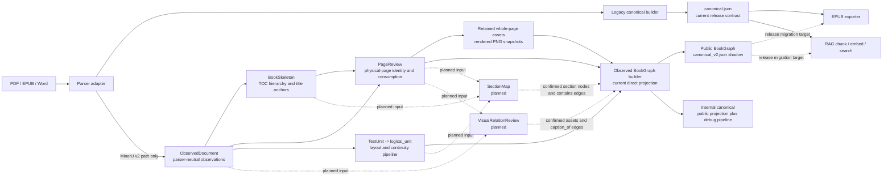

# Architecture

`inkline` is a monorepo with multiple Python packages. The main design rule is
that `inkline.canonical` is the only cross-stage document contract.

## Architecture Dependency Graph

This diagram describes ownership and data dependencies. Solid arrows are implemented
today. Dashed arrows are planned canonical-v2 stages and must not be read as current
runtime behavior.



The important boundaries are:

- `PageReview` depends on both `ObservedDocument` and `BookSkeleton`. Skeleton supplies
  TOC pages, provisional matter boundaries, and title-start anchors; PageReview does
  not turn those anchors into logical section membership.
- `materialize_v2_page_assets` renders every page whose PageReview
  `visual_asset_action` is `retain`. It adds whole-page PNG records to
  `ObservedDocument.assets.images`; it does not perform OCR repair, image cropping,
  caption matching, or section assignment.
- `SectionMap` and `VisualRelationReview` are planned. Neither currently participates
  in BookGraph construction.
- EPUB and RAG still consume `canonical.json` by default. BookGraph is the migration
  target, not the current release input.

## Current Canonical-v2 Runtime Sequence

This diagram follows `build_v2_artifacts()` and the current observed BookGraph builder.
It is intentionally separate from the dependency graph above: runtime order and
architectural dependency are different questions.

```mermaid
sequenceDiagram
    participant Orchestrator as canonical_v2 orchestrator
    participant Observed as ObservedDocument builder
    participant Skeleton as BookSkeleton builder
    participant Review as PageReview builder
    participant Assets as Page asset materializer
    participant Graph as Observed BookGraph builder

    Orchestrator->>Observed: build_observed_document_shadow(raw MinerU inputs)
    Observed-->>Orchestrator: observed

    Orchestrator->>Skeleton: build_book_skeleton_shadow(observed)
    Note over Skeleton: Optional TOC LLM; physical pages still come from observed title evidence
    Skeleton-->>Orchestrator: skeleton

    Orchestrator->>Review: build_page_review_shadow(observed, skeleton)
    Note over Review: Rebuild TextUnits, layout audit, and page roles for review routing
    Note over Review: Use Skeleton boundaries, TOC pages, and body-section starts
    Review-->>Orchestrator: page_review

    alt unresolved candidates and PageReview LLM disabled
        Orchestrator-->>Orchestrator: withhold public BookGraph and return intermediate artifacts
    else PageReview is resolved
        Orchestrator->>Orchestrator: validate_resolved_page_review(page_review)
        Orchestrator->>Assets: materialize_v2_page_assets(observed, page_review)
        Note over Assets: Render retained physical pages as 150-DPI whole-page PNG files
        Assets-->>Orchestrator: observed_with_assets

        Orchestrator->>Graph: build_bookgraph_from_observed(observed_with_assets, page_review)
        Note over Graph: Build TextUnits -> layout classification -> logical_units
        Note over Graph: Merge continuity -> filter logical_units by PageReview
        Note over Graph: Create nodes/evidence/appears_on_page -> resolve notes -> strip debug fields
        Graph-->>Orchestrator: public_graph

        Orchestrator->>Graph: build_internal_canonical_from_observed(observed_with_assets, page_review)
        Note over Graph: Current code repeats the same observed-to-BookGraph pipeline
        Note over Graph: Then wraps public entities with page/node/edge/evidence debug records
        Graph-->>Orchestrator: internal_canonical
    end

    Note over Orchestrator,Graph: SectionMap and VisualRelationReview are not present in this runtime yet
```

The current duplication between public and internal construction is real: both public
entry points call `build_observed_bookgraph_artifacts()` independently. A future
SectionMap integration should build the shared observed/text-flow/section artifacts
once, then derive both outputs from that single result.

## Package Boundaries

- `inkline-canonical` owns types, schema versioning, validation, provenance, and IO.
- `inkline-llm` owns local model clients such as Ollama chat/vision helpers. It
  must not know about canonical documents, parser internals, RAG records, or note
  repair semantics.
- `inkline-parse` owns the parser protocol, registry, task state, and orchestration.
- `inkline-parser-mineru` implements the protocol and owns MinerU-specific extraction,
  normalization, layout repair, note recovery, marker-locator prompts/evidence,
  and raw outputs. It may use `inkline-llm` for Qwen calls.
- A future `inkline-parser-paddle` package should implement the same protocol.
- `inkline-epub` consumes canonical JSON only.
- `inkline-rag` consumes canonical JSON or chunk JSONL only. Answer-generation
  features may use `inkline-llm`, but must not import parser adapters.
- `inkline-cli` wires packages together without owning parser behavior.

## Dependency Direction

```text
inkline-canonical
       ^
       |
inkline-parse <--- inkline-parser-mineru
       ^
       |
inkline-cli ---> inkline-epub
       \------> inkline-rag

inkline-llm <--- inkline-parser-mineru
      ^
      \------ inkline-rag
```

Parser adapters may depend on `inkline-parse` and `inkline-canonical`.
The common packages must never import a concrete parser adapter.
Installed adapters register themselves through the `inkline.parsers` entry-point
group, so the CLI does not maintain a hard-coded parser list.

`inkline-llm` is a shared service package, not a document contract. It provides
transport and response-shaping helpers for local LLMs; domain-specific prompts,
evidence schemas, and writeback behavior belong to the package that owns that
workflow. Shared defaults such as the local Ollama chat URL and the default Qwen
model live here so parser and RAG packages do not duplicate model wiring.

## Migration Notes

- `pdf-parser-eval` remains the source of parser evaluation history and the first canonical contract.
- The former standalone MinerU normalization code now lives directly under
  `inkline.parsers.mineru`; its algorithms remain parser-specific until
  a second adapter demonstrates a real reusable normalization boundary.
- `corpus-rag` provides RAG implementation patterns, but its EPUB normalized JSONL is not a long-term boundary.
- `booksmith` provides the EPUB packaging direction; this repository starts with a dependency-free EPUB writer that can be swapped for a richer builder without changing the canonical contract.
