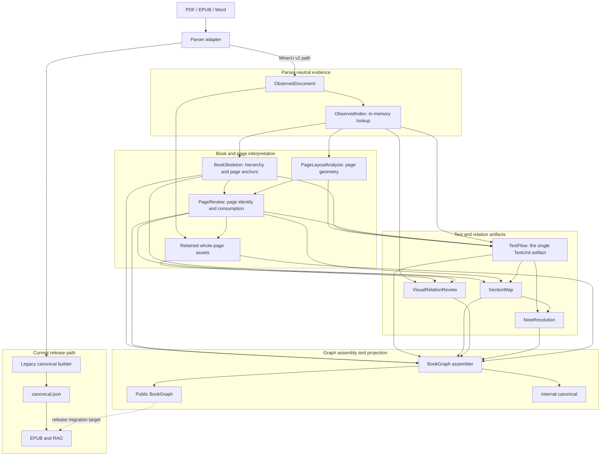
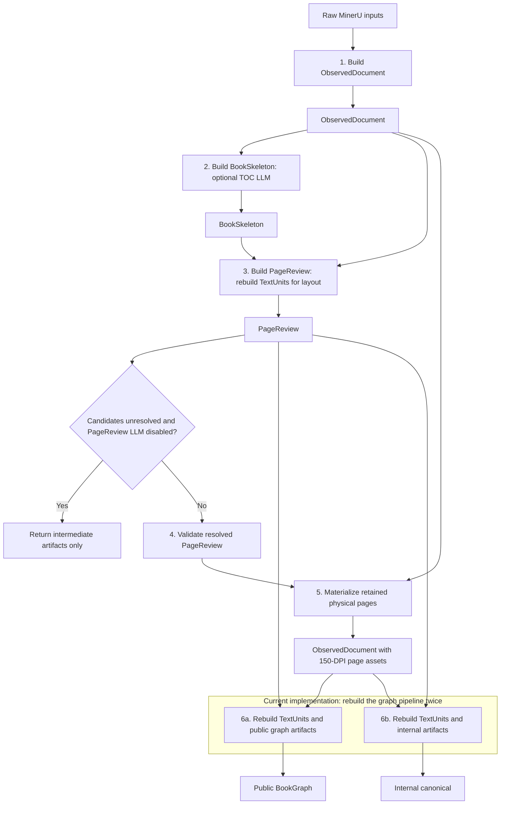

# Architecture

`inkline` is a monorepo with multiple Python packages. The main design rule is
that `inkline.canonical` is the only cross-stage document contract.

## Target Canonical Artifact DAG

Canonical v2 is an explicit dependency DAG of validated artifacts. It is neither a
set of isolated builders that rediscover the same facts nor a mutable document passed
through a rigid linear pipeline. Each builder consumes named upstream artifacts,
returns a new immutable artifact, and performs each deterministic computation once.

Solid arrows below are target data dependencies. The implementation-status notes
after the diagram distinguish current code from the target architecture.



The important boundaries are:

- Parser adapters stop at `ObservedDocument`. MinerU-specific structures remain in
  the adapter or explicit parser payloads; every later artifact is parser-neutral.
- `PageLayoutAnalysis` owns reusable page geometry and body-lane evidence. PageReview
  must not construct final TextUnits merely to obtain page-level signals.
- `PageReview` combines `PageLayoutAnalysis` with `BookSkeleton`. Skeleton supplies TOC
  pages, provisional matter boundaries, and title-start anchors; PageReview does not
  turn those anchors into logical section membership.
- `TextFlow` is built once after Skeleton and resolved PageReview. It is the only stage
  that creates TextUnits and classifies `heading`, `paragraph`, `display_block`,
  `list_item`, and `footnote`. Verified Skeleton title-observation groups are protected
  structural boundaries, and PageReview-excluded pages do not enter reading flow. Its
  ordered TextUnits are authoritative for downstream structure; the target does not
  add a second competing `lu...` identity namespace.
- `SectionMap` assigns TextFlow units and physical pages to Skeleton sections. It does
  not classify paragraphs or repair an invalid TextFlow boundary.
- The current `materialize_v2_page_assets` returns an ObservedDocument copy with
  retained whole-page PNG records. The target DAG materializes those records as a
  separate `PageAssets` artifact so ObservedDocument remains immutable. Neither form
  performs OCR repair, image cropping, caption matching, or section assignment.
- `VisualRelationReview` and `NoteResolution` are sibling relation artifacts rather
  than hidden repair passes inside BookGraph assembly.
- The assembler consumes completed artifacts and does no parser repair, TextUnit
  aggregation, page review, or section-boundary discovery. Public BookGraph and
  internal canonical are two views of the same assembled result.
- EPUB and RAG still consume `canonical.json` by default. BookGraph is the migration
  target, not the current release input.

## Current Canonical-v2 Runtime Flow

This diagram follows the artifacts produced by `build_v2_artifacts()` and the current
observed BookGraph builder. Builders sit between their inputs and outputs, so the
data dependencies remain visible without call-and-return arrows.



BookSkeleton may use an optional TOC LLM, but its physical-page anchors are resolved
against `ObservedDocument` evidence. The current PageReview path builds TextUnits once
to derive its layout audit. Public BookGraph construction and internal-canonical
construction then each call `build_observed_bookgraph_artifacts()` independently and
rebuild TextUnits again. A complete run can therefore generate TextUnits three times.
This is implementation debt, not an intended modularity trade-off.

`SectionMap`, `VisualRelationReview`, the target TextFlow artifact, and the shared
BookGraph assembler are not present in this runtime yet. Migration to the target DAG
must first separate reusable `PageLayoutAnalysis` from final TextFlow, then build one
TextFlow artifact after resolved PageReview and share the same artifact bundle across
SectionMap, public BookGraph, and internal canonical.

## Artifact Materialization and Schema Lifecycle

Major DAG nodes are independently validated development artifacts. Orchestration may
materialize them for golden review, resume, debugging, or agent scheduling; domain
builders return values and do not choose filesystem paths. `ObservedIndex` is the
exception: it is a read-only in-memory lookup over ObservedDocument rather than a
separately persisted contract.

During pre-release development, artifact schemas may use temporary versions such as
`0.1-shadow`. Breaking changes do not require compatibility readers or migrations;
affected development artifacts and goldens are regenerated. Before the first release,
the selected contracts are frozen under one release schema version. After release,
schema changes and migrations are handled at release boundaries.

The explicit dependency graph is also the future agent boundary. A deterministic
orchestrator owns scheduling and materialization now. A later agent may select, resume,
or verify DAG nodes, but it must call the same builders and validators rather than move
domain decisions into prompts.

## Package Boundaries

- `inkline-canonical` owns types, schema versioning, validation, provenance, and IO.
- `inkline-llm` owns local model clients such as Ollama chat/vision helpers. It
  must not know about canonical documents, parser internals, RAG records, or note
  repair semantics.
- `inkline-parse` owns the parser protocol, registry, task state, and orchestration.
- `inkline-parser-mineru` implements the protocol and owns MinerU-specific extraction,
  normalization, layout repair, note recovery, marker-locator prompts/evidence,
  and raw outputs. It may use `inkline-llm` for Qwen calls.
- A future `inkline-parser-paddle` package should implement the same protocol.
- `inkline-epub` consumes canonical JSON only.
- `inkline-rag` consumes canonical JSON or chunk JSONL only. Answer-generation
  features may use `inkline-llm`, but must not import parser adapters.
- `inkline-cli` wires packages together without owning parser behavior.

## Dependency Direction

```text
inkline-canonical
       ^
       |
inkline-parse <--- inkline-parser-mineru
       ^
       |
inkline-cli ---> inkline-epub
       \------> inkline-rag

inkline-llm <--- inkline-parser-mineru
      ^
      \------ inkline-rag
```

Parser adapters may depend on `inkline-parse` and `inkline-canonical`.
The common packages must never import a concrete parser adapter.
Installed adapters register themselves through the `inkline.parsers` entry-point
group, so the CLI does not maintain a hard-coded parser list.

`inkline-llm` is a shared service package, not a document contract. It provides
transport and response-shaping helpers for local LLMs; domain-specific prompts,
evidence schemas, and writeback behavior belong to the package that owns that
workflow. Shared defaults such as the local Ollama chat URL and the default Qwen
model live here so parser and RAG packages do not duplicate model wiring.

## Migration Notes

- `pdf-parser-eval` remains the source of parser evaluation history and the first canonical contract.
- The former standalone MinerU normalization code now lives directly under
  `inkline.parsers.mineru`; its algorithms remain parser-specific until
  a second adapter demonstrates a real reusable normalization boundary.
- `corpus-rag` provides RAG implementation patterns, but its EPUB normalized JSONL is not a long-term boundary.
- `booksmith` provides the EPUB packaging direction; this repository starts with a dependency-free EPUB writer that can be swapped for a richer builder without changing the canonical contract.
