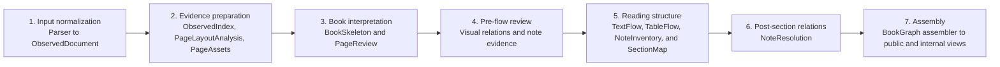
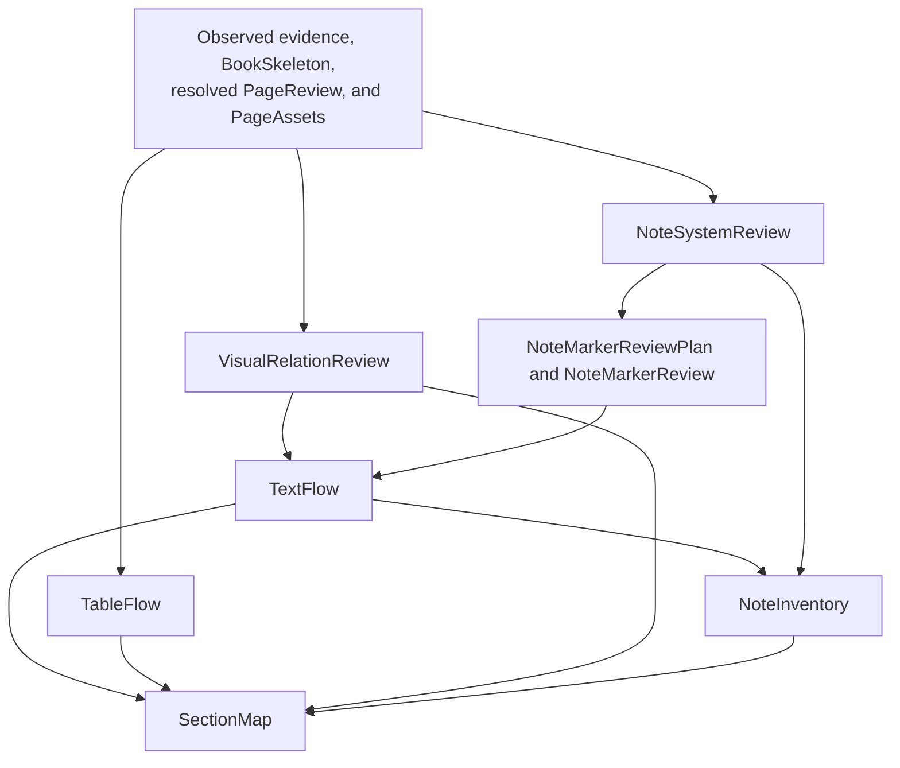
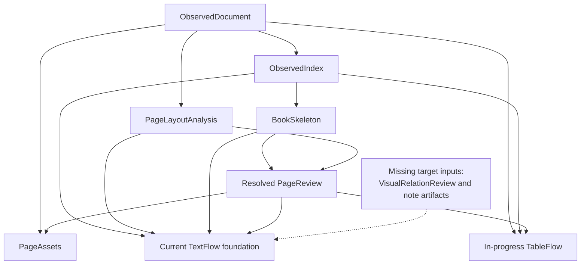

# Architecture

`inkline` is a monorepo with multiple Python packages. The main design rule is
that `inkline.canonical` is the only cross-stage document contract.

## Target Canonical Artifact DAG

Canonical v2 is an explicit dependency DAG of validated artifacts. It is neither a
set of isolated builders that rediscover the same facts nor a mutable document passed
through a rigid linear pipeline. Each builder consumes named upstream artifacts,
returns a new immutable artifact, and performs each deterministic computation once.

One overview diagram cannot legibly show both stage order and every fan-in edge. The
overview therefore shows only the seven execution phases; the I/O table is the
authoritative dependency definition.



| Builder or stage | Required inputs | Output | Acceptance gate |
| --- | --- | --- | --- |
| Parser adapter | Parser-specific source artifacts | `ObservedDocument` | ObservedDocument contract validation |
| Observed index | `ObservedDocument` | `ObservedIndex` | Contract tests plus regenerated 13-book Skeleton golden comparison after Skeleton adopts the index |
| Book skeleton | `ObservedIndex` | `BookSkeleton` | 13-book Skeleton golden comparison |
| Page layout | `ObservedIndex` | `PageLayoutAnalysis` | Contract and geometry characterization tests |
| Page review | `BookSkeleton`, `PageLayoutAnalysis` | `PageReview` | Staged regeneration and 13-book PageReview golden comparison |
| Page assets | `ObservedDocument`, `PageReview` | `PageAssets` | Asset provenance and page-action validation |
| Visual relations | `ObservedIndex`, `PageLayoutAnalysis`, `PageReview`, `PageAssets` | `VisualRelationReview` | Relation, endpoint-kind, ownership, and unpaired-endpoint validation |
| Note systems | `ObservedIndex`, `PageLayoutAnalysis`, `BookSkeleton`, `PageReview`, `PageAssets` | `NoteSystemReview` | 13-book system/range/scope audit; mixed systems remain separate |
| Note marker plan | `ObservedIndex`, `PageLayoutAnalysis`, `NoteSystemReview` | `NoteMarkerReviewPlan` | Every review request has a bounded region and structural reason |
| Note marker review | `ObservedIndex`, `PageAssets`, `NoteMarkerReviewPlan` | `NoteMarkerReview` | Marker/anchor/provenance validation; absent, failed, and unresolved remain distinct |
| Text flow | `ObservedIndex`, `PageLayoutAnalysis`, `BookSkeleton`, `PageReview`, `VisualRelationReview`, `NoteSystemReview`, `NoteMarkerReview` | `TextFlow` | 13-book freeze; one TextFlow build per workflow run |
| Table flow | `ObservedDocument`, `ObservedIndex`, resolved `PageReview` | `TableFlow` | Parser-neutral table contract tests; every table observation consumed, excluded, or unresolved |
| Note inventory | `TextFlow`, `NoteSystemReview`, `NoteMarkerReview` | `NoteInventory` | Definition/reference/group coverage; no dangling TextUnit or inline-run ids |
| Section map | `BookSkeleton`, `PageReview`, `TextFlow`, `TableFlow`, `VisualRelationReview`, `NoteInventory` | `SectionMap` | Automated membership gates; Task 4 manual acceptance |
| Note resolution | `NoteInventory`, `SectionMap` | `NoteResolution` | Reference, scope, and unresolved-case validation |
| BookGraph assembler | Validated `CanonicalArtifactBundle` | Public `BookGraph` and internal canonical view | Projection parity; no upstream recomputation |

Use small local diagrams when a fan-in deserves explanation. For example, the core
page/text/section dependencies are:



The important boundaries are:

- Parser adapters stop at `ObservedDocument`. MinerU-specific structures remain in
  the adapter or explicit parser payloads; every later artifact is parser-neutral.
- `PageLayoutAnalysis` owns reusable page geometry and body-lane evidence. PageReview
  must not construct final TextUnits merely to obtain page-level signals.
- `PageReview` combines `PageLayoutAnalysis` with `BookSkeleton`. Skeleton supplies TOC
  pages, provisional matter boundaries, and title-start anchors; PageReview does not
  turn those anchors into logical section membership.
- `VisualRelationReview` runs before final TextFlow. It groups existing visual and
  caption observations without rewriting their content. TextFlow then materializes
  caption observations as `caption`, not as a provisional `display_block`. SectionMap
  consumes the validated group and never invents `caption_of`.
- Note handling is split before and after SectionMap. `NoteSystemReview` identifies
  page-foot, chapter-end, book-end, and mixed systems. `NoteMarkerReview` recognizes
  printed definition/reference markers from bounded visual evidence. TextFlow inserts
  unresolved `note_ref` inline runs; NoteInventory audits them before SectionMap; and
  NoteResolution later emits target relations without modifying any earlier artifact.
- `TextFlow` is built once after Skeleton, resolved PageReview, and the required visual
  and note reviews. It is the only stage that creates TextUnits and classifies
  `heading`, `paragraph`, `display_block`, `caption`, `list_item`, and `footnote`.
  Verified Skeleton title-observation groups are protected structural boundaries, and
  PageReview-excluded pages do not enter ordinary reading flow. Its ordered TextUnits
  are authoritative for downstream structure; the target does not add a second
  competing `lu...` identity namespace.
- `TableFlow` is also built only after resolved PageReview. Parser adapters first
  normalize source tables into parser-neutral observation attributes. TableFlow
  serializes readable tables and joins their explicit continuation observations.
  PageReview-excluded table observations remain excluded; when PageReview splits one
  logical multi-page table between included and excluded pages, the whole candidate is
  unresolved rather than materializing a misleading half-table.
- `NoteInventory` is materialized once from final TextFlow and the validated note
  reviews. It inventories definitions, inline references, note groups, and unresolved
  coverage; it does not publish final targets.
- `SectionMap` assigns TextFlow units, TableFlow tables, visual groups, note groups,
  and physical pages to Skeleton sections. It does not classify paragraphs, repair an
  invalid TextFlow boundary, discover image-caption relations, resolve note targets,
  or reinterpret an unresolved table candidate.
- `materialize_v2_page_assets` can return an ObservedDocument copy for its compatibility
  wrapper, while the workflow stores its asset value separately so ObservedDocument
  remains immutable. It renders PageReview-retained pages plus pages containing an
  `image_region`, ensuring bounded visual review can inspect included body pages.
  It performs no OCR repair, image cropping, caption matching, or section assignment.
- Every artifact is immutable after validation. Downstream builders may copy and
  project its facts, but never edit it. In particular, SectionMap does not change
  TextFlow inline runs, NoteResolution does not write targets back into TextFlow, and
  BookGraph assembly writes resolved targets only into the assembled BookGraph copy.
- The assembler consumes completed artifacts and does no parser repair, TextUnit
  aggregation, page review, or section-boundary discovery. Public BookGraph and
  internal canonical are two views of the same assembled result.
- EPUB and RAG still consume `canonical.json` by default. BookGraph is the migration
  target, not the current release input.

Detailed contracts and the revised implementation order are recorded in:

- [the frozen BookGraph upstream artifact contracts](bookgraph-upstream-artifact-contracts.md)
- [VisualRelationReview before TextFlow](visual-relation-review-design.md)
- [note processing before and after SectionMap](note-processing-design.md)
- [the SectionMap upstream replan](section-map-upstream-replan.md)

## Current Canonical-v2 Runtime Flow

This diagram follows the in-progress `build_canonical_artifacts()` workflow on the
current development branch. It deliberately labels outputs whose target inputs do not
exist yet.



The framework-neutral `build_canonical_artifacts()` workflow currently materializes
`ObservedIndex`, `PageLayoutAnalysis`, resolved `PageReview`, a TextFlow foundation,
`TableFlow`, and `PageAssets`. The SectionMap contract exists in
`inkline-canonical`, but SectionMap is not a live workflow stage. The workflow does
not yet materialize VisualRelationReview, the note review artifacts, or NoteInventory.
Consequently, its current TextFlow output is a development foundation, not the
accepted final forms described by the target DAG. The release-facing observed
BookGraph and internal-canonical builders still use their separate legacy path and
may rebuild their own units. Switching those projections remains later work.

## Artifact Materialization and Schema Lifecycle

Major DAG nodes are independently validated development artifacts. Orchestration may
materialize them for golden review, resume, debugging, or agent scheduling; domain
builders return values and do not choose filesystem paths. `ObservedIndex` is the
exception: it is a read-only in-memory lookup over ObservedDocument rather than a
separately persisted contract.

During pre-release development, artifact schemas may use temporary versions such as
`0.1-shadow`. Breaking changes do not require compatibility readers or migrations;
affected development artifacts and goldens are regenerated. Before the first release,
the selected contracts are frozen under one release schema version. After release,
schema changes and migrations are handled at release boundaries.

The explicit dependency graph is also the future agent boundary. The planned
`inkline-workflow` package owns deterministic scheduling and materialization. A later
LangChain/LangGraph adapter may select, resume, or verify DAG nodes, but it must call
the same framework-neutral stages, builders, and validators rather than move domain
decisions into prompts.

## Package Boundaries

- `inkline-canonical` owns types, schema versioning, validation, provenance, and IO.
- `inkline-llm` owns local model clients such as Ollama chat/vision helpers. It
  must not know about canonical documents, parser internals, RAG records, or note
  repair semantics.
- `inkline-parse` owns the parser protocol, registry, and ingestion run state. It ends
  at the parser-produced `ObservedDocument` and does not schedule canonical artifacts.
- The planned `inkline-workflow` package owns canonical DAG stage declarations,
  deterministic scheduling, artifact storage, materialization, and resume policy. It
  contains no parser-specific or canonical domain decisions.
- `inkline-parser-mineru` implements the protocol and owns MinerU-specific extraction,
  normalization, raw outputs, and legacy canonical-v1 repairs. For canonical v2 it may
  expose parser hints through ObservedDocument, but it does not own final visual groups,
  note systems, marker review, or note resolution. Parser-neutral review prompts,
  evidence schemas, and validators live with their canonical domain artifacts and may
  use `inkline-llm` for transport.
- A future `inkline-parser-paddle` package should implement the same protocol.
- `inkline-epub` consumes canonical JSON only.
- `inkline-rag` consumes canonical JSON or chunk JSONL only. Answer-generation
  features may use `inkline-llm`, but must not import parser adapters.
- `inkline-cli` composes parsing with workflow execution without owning either parser
  behavior or canonical domain decisions.

## Dependency Direction

```text
inkline-parser-mineru ---> inkline-parse ---> inkline-canonical
inkline-workflow -------------------------> inkline-canonical

inkline-cli ---> inkline-parse
       |------> inkline-workflow
       |------> inkline-epub
       \------> inkline-rag

inkline-parser-mineru ---> inkline-llm <--- inkline-rag
```

Parser adapters may depend on `inkline-parse` and `inkline-canonical`.
The common packages must never import a concrete parser adapter.
Installed adapters register themselves through the `inkline.parsers` entry-point
group, so the CLI does not maintain a hard-coded parser list.

`inkline-workflow` accepts an already validated `ObservedDocument`; it does not need
to import `inkline-parse`. The CLI is the composition root that invokes a parser and
then hands its output to the workflow. A future agent integration depends on
`inkline-workflow`, not the reverse, so LangChain/LangGraph remains replaceable.

`inkline-llm` is a shared service package, not a document contract. It provides
transport and response-shaping helpers for local LLMs; domain-specific prompts,
evidence schemas, and writeback behavior belong to the package that owns that
workflow. Shared defaults such as the local Ollama chat URL and the default Qwen
model live here so parser and RAG packages do not duplicate model wiring.

## Migration Notes

- `pdf-parser-eval` remains the source of parser evaluation history and the first canonical contract.
- The former standalone MinerU normalization code now lives directly under
  `inkline.parsers.mineru`; its algorithms remain parser-specific until
  a second adapter demonstrates a real reusable normalization boundary.
- `corpus-rag` provides RAG implementation patterns, but its EPUB normalized JSONL is not a long-term boundary.
- `booksmith` provides the EPUB packaging direction; this repository starts with a dependency-free EPUB writer that can be swapped for a richer builder without changing the canonical contract.
