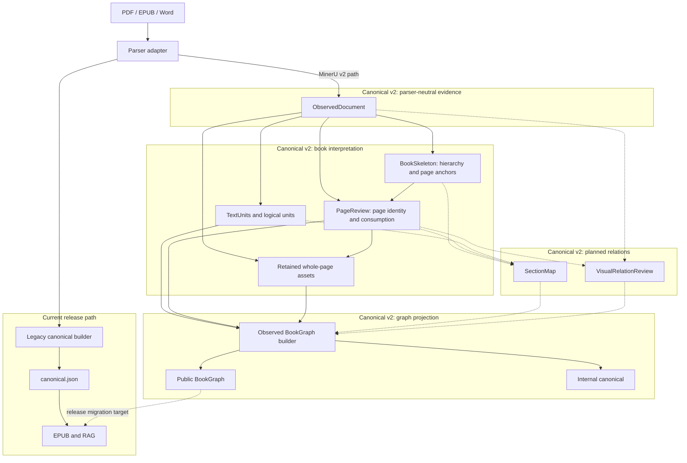

# Architecture

`inkline` is a monorepo with multiple Python packages. The main design rule is
that `inkline.canonical` is the only cross-stage document contract.

## Architecture Dependency Graph

This diagram describes ownership and data dependencies. Solid arrows are implemented
today. Dashed arrows are planned canonical-v2 stages and must not be read as current
runtime behavior.



The important boundaries are:

- `PageReview` depends on both `ObservedDocument` and `BookSkeleton`. Skeleton supplies
  TOC pages, provisional matter boundaries, and title-start anchors; PageReview does
  not turn those anchors into logical section membership.
- `materialize_v2_page_assets` renders every page whose PageReview
  `visual_asset_action` is `retain`. It adds whole-page PNG records to
  `ObservedDocument.assets.images`; it does not perform OCR repair, image cropping,
  caption matching, or section assignment.
- `SectionMap` and `VisualRelationReview` are planned. Neither currently participates
  in BookGraph construction.
- EPUB and RAG still consume `canonical.json` by default. BookGraph is the migration
  target, not the current release input.

## Current Canonical-v2 Runtime Flow

This diagram follows the artifacts produced by `build_v2_artifacts()` and the current
observed BookGraph builder. Builders sit between their inputs and outputs, so the
data dependencies remain visible without call-and-return arrows.


BookSkeleton may use an optional TOC LLM, but its physical-page anchors are resolved
against `ObservedDocument` evidence. PageReview rebuilds TextUnits, audits layout,
classifies page roles, and combines those results with Skeleton boundaries, TOC pages,
and body-section starts.

The current duplication between public and internal construction is real: both entry
points call `build_observed_bookgraph_artifacts()` independently. `SectionMap` and
`VisualRelationReview` are not present in this runtime yet. A future integration should
build the shared observed, text-flow, and relation artifacts once, then derive both
outputs from that single result.

## Package Boundaries

- `inkline-canonical` owns types, schema versioning, validation, provenance, and IO.
- `inkline-llm` owns local model clients such as Ollama chat/vision helpers. It
  must not know about canonical documents, parser internals, RAG records, or note
  repair semantics.
- `inkline-parse` owns the parser protocol, registry, task state, and orchestration.
- `inkline-parser-mineru` implements the protocol and owns MinerU-specific extraction,
  normalization, layout repair, note recovery, marker-locator prompts/evidence,
  and raw outputs. It may use `inkline-llm` for Qwen calls.
- A future `inkline-parser-paddle` package should implement the same protocol.
- `inkline-epub` consumes canonical JSON only.
- `inkline-rag` consumes canonical JSON or chunk JSONL only. Answer-generation
  features may use `inkline-llm`, but must not import parser adapters.
- `inkline-cli` wires packages together without owning parser behavior.

## Dependency Direction

```text
inkline-canonical
       ^
       |
inkline-parse <--- inkline-parser-mineru
       ^
       |
inkline-cli ---> inkline-epub
       \------> inkline-rag

inkline-llm <--- inkline-parser-mineru
      ^
      \------ inkline-rag
```

Parser adapters may depend on `inkline-parse` and `inkline-canonical`.
The common packages must never import a concrete parser adapter.
Installed adapters register themselves through the `inkline.parsers` entry-point
group, so the CLI does not maintain a hard-coded parser list.

`inkline-llm` is a shared service package, not a document contract. It provides
transport and response-shaping helpers for local LLMs; domain-specific prompts,
evidence schemas, and writeback behavior belong to the package that owns that
workflow. Shared defaults such as the local Ollama chat URL and the default Qwen
model live here so parser and RAG packages do not duplicate model wiring.

## Migration Notes

- `pdf-parser-eval` remains the source of parser evaluation history and the first canonical contract.
- The former standalone MinerU normalization code now lives directly under
  `inkline.parsers.mineru`; its algorithms remain parser-specific until
  a second adapter demonstrates a real reusable normalization boundary.
- `corpus-rag` provides RAG implementation patterns, but its EPUB normalized JSONL is not a long-term boundary.
- `booksmith` provides the EPUB packaging direction; this repository starts with a dependency-free EPUB writer that can be swapped for a richer builder without changing the canonical contract.
