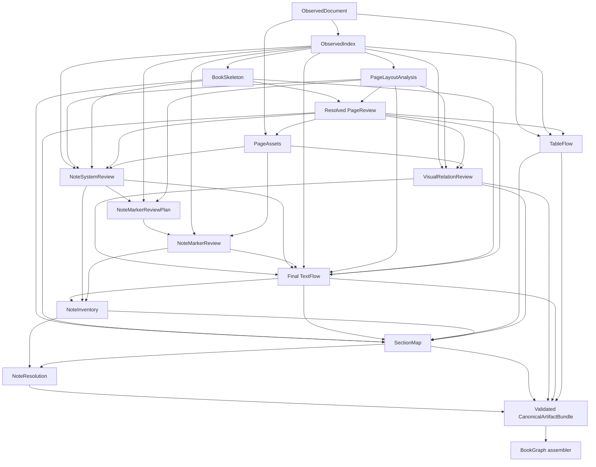

# BookGraph Upstream Artifact Contracts

**Status:** Frozen pre-release target contracts

**Contract version:** 2026-07-31

## Scope and Runtime Status

This document is the authoritative target contract for the artifacts between
resolved `PageReview` and BookGraph assembly. It freezes names, responsibilities,
dependencies, identity/provenance rules, validation boundaries, and acceptance order.
It does not claim that every target builder or workflow stage already exists.

The live `build_canonical_artifacts()` runtime currently builds `ObservedIndex`,
`BookSkeleton`, `PageLayoutAnalysis`, resolved `PageReview`, `TableFlow`, a TextFlow
foundation, and `PageAssets`. It does not yet build `VisualRelationReview`,
`NoteSystemReview`, `NoteMarkerReviewPlan`, `NoteMarkerReview`, `NoteInventory`,
`SectionMap`, or `NoteResolution`. The live BookGraph assembler consumes the current
TextFlow directly and still invokes the legacy BookGraph note resolver. Those are
development facts, not the target dependency contract.

The executable responsibility registry is
`inkline.canonical.artifact_dag.CANONICAL_ARTIFACT_CONTRACTS`. The schema names,
versions, and validators live in their owning `inkline-canonical` packages.

## Execution Flow

The solid arrows are required artifact dependencies. `ObservedDocument` also remains
the source for parser-neutral `TableFlow`; `ObservedIndex` is its read-only lookup
view. The assembler consumes the completed bundle, not selected loose artifacts.



## Artifact Dependency and Ownership Table

| artifact | inputs | outputs | owns | must_not_own | validation |
| --- | --- | --- | --- | --- | --- |
| `VisualRelationReview` | `ObservedIndex`, `PageLayoutAnalysis`, resolved `PageReview`, `PageAssets` | visual groups, relation evidence, unpaired endpoints, unresolved candidates | same-page non-table visual/caption relations and endpoint audit state | caption text, table captions, OCR repair, section membership, BookGraph nodes | endpoint identity/kind, single ownership, same-page scope, evidence/model provenance, TableFlow caption exclusion |
| `NoteSystemReview` | `ObservedIndex`, `PageLayoutAnalysis`, `BookSkeleton`, resolved `PageReview`, `PageAssets` | separate page-foot, chapter-end, and book-end systems plus unresolved candidates | definition ranges, reference scope, marker styles, reset policy | printed marker recognition, TextUnits, section membership, final targets | range/scope/reset consistency, evidence identity, mixed-system separation |
| `NoteMarkerReviewPlan` | `ObservedIndex`, `PageLayoutAnalysis`, `NoteSystemReview` | bounded definition/reference review requests and explicit no-review/unresolved partitions | regions, structural review reasons, request coverage | visual recognition results, TextUnits, section membership, targets | non-empty bounded regions, known ids, complete one-state partition of note systems |
| `NoteMarkerReview` | `ObservedIndex`, `PageAssets`, `NoteMarkerReviewPlan` | per-request `found`, `absent`, `not_run`, `failed`, or `unresolved` outcomes and localized marker evidence | printed definition/reference marker location and model provenance | invented markers, TextUnits, section membership, targets | exact request coverage, region containment, adjacent-text anchoring, distinct execution states |
| final `TextFlow` | `ObservedIndex`, `PageLayoutAnalysis`, `BookSkeleton`, resolved `PageReview`, `VisualRelationReview`, `NoteSystemReview`, `NoteMarkerReview` | ordered final `tu...` TextUnits and unresolved `note_ref` inline runs | TextUnit identity/order/type, caption units, note-reference location | visual pairing, note targets, section membership, tables | observation/order/anchor coverage, caption-group coverage, reference-marker coverage, unresolved target invariant |
| `TableFlow` | `ObservedDocument`, `ObservedIndex`, resolved `PageReview` | logical readable tables, excluded runs, unresolved runs | structured-table continuation, table captions, readable serialization | non-table visual captions, section membership, half-table materialization | every table observation consumed/excluded/unresolved exactly once, PageReview consistency, source provenance |
| `NoteInventory` | final `TextFlow`, `NoteSystemReview`, `NoteMarkerReview` | definitions, inline references, note groups, unresolved/duplicate/orphan/ambiguous cases | note membership and marker-coverage audit | authoritative targets, section membership, TextFlow mutation | no dangling TextUnit/run/system/evidence ids, complete `note_ref` coverage, system separation |
| `SectionMap` | `BookSkeleton`, resolved `PageReview`, final `TextFlow`, `TableFlow`, `VisualRelationReview`, `NoteInventory` | hierarchy, ranges, page placements, and TextUnit/table/visual-group/note-group placements | section membership and explicit `section_member`/`standalone`/`unresolved` state | paragraph/type repair, visual relation discovery, table reinterpretation, note targets | all upstream ids placed once, evidence-backed range/membership, tree validity, page/resource coverage |
| `NoteResolution` | `NoteInventory`, confirmed `SectionMap` | immutable resolved relations and unresolved references | unique page/chapter/book-scoped target relations | mutation of TextFlow, NoteInventory, or SectionMap | complete reference partition, marker/system identity, page/chapter scope consistency |
| BookGraph assembler | completed validated `CanonicalArtifactBundle` | public BookGraph and internal canonical view | identity projection, `caption_of`/`contains`/`references_note` edges, public/internal views | parser repair, TextUnit rebuilding, section inference, upstream mutation | bundle completeness, upstream id mapping, projection parity |

## Schema and Identity Contracts

All artifacts use exact top-level fields and metadata containing exactly
`schema_name`, `schema_version`, and `doc_id`. Current frozen versions are
pre-release `0.1-shadow`; breaking changes regenerate development artifacts and do not
receive compatibility readers.

### VisualRelationReview

- Schema: `inkline_visual_relation_review` `0.1-shadow`.
- Top-level fields: `metadata`, `evidence`, `visual_groups`,
  `unpaired_asset_observation_ids`, `unpaired_caption_observation_ids`,
  `unresolved_candidates`.
- Group ids are ordered `vg000001...`; evidence ids are `vre000001...`; unresolved
  candidate ids are `vrc000001...`.
- A group contains one or more `image_region` observation ids and one or more
  text/caption observation ids, `relation_type=caption_of`, one initial-contract
  physical page, evidence ids, decision source, and confidence.
- An endpoint has one audit state: grouped, unpaired, or unresolved. TableFlow-owned
  caption observations cannot also be visual endpoints.

### NoteSystemReview

- Schema: `inkline_note_system_review` `0.1-shadow`.
- Top-level fields: `metadata`, `evidence`, `note_systems`,
  `unresolved_system_candidates`.
- System ids are `ns000001...`; evidence ids are `nse000001...`.
- `page_footnote` uses page scope/reset. `chapter_endnote` uses chapter scope/reset.
  `book_endnote` may use book scope/reset or explicit chapter grouping/reset.
- A mixed book is multiple separate systems. It is never one scalar `mixed` system.
- Different systems may occupy the same physical page when their definition
  observations and evidence remain separate. Uncertain scope stays unresolved
  instead of becoming an inferred chapter or book claim.

### NoteMarkerReviewPlan and NoteMarkerReview

- Plan schema: `inkline_note_marker_review_plan` `0.1-shadow`; request ids are
  `nmp000001...`.
- Every request names one note system, one `definition` or `reference` kind, one or
  more page+bbox+observation regions, one or more structural reasons, and evidence.
- Every known note system appears in exactly one plan state: has requests,
  `not_required`, or `unresolved`.
- Result schema: `inkline_note_marker_review` `0.1-shadow`; marker evidence ids are
  globally ordered `nmr000001...`.
- Every request has exactly one outcome. `not_run`, `failed`, `absent`, and
  `unresolved` are distinct. Only `found` contains marker evidence. A result cannot
  leave the planned page, crop, or observation.

### Final TextFlow

- Schema remains `inkline_text_flow` `0.1-shadow` during pre-release development.
- Final unit types are `heading`, `paragraph`, `display_block`, `caption`,
  `list_item`, and `footnote`.
- A grouped caption observation becomes a `caption` TextUnit with
  `attrs.visual_group_id`; it is not first frozen as `display_block` and reclassified
  downstream. Every grouped caption observation is materialized once, and image
  observations never become TextUnits.
- A printed reference becomes an inline run with exact fields `type`, `marker`,
  `text`, `source_page`, `target_note_id`, `resolution_status`, and `evidence_ids`.
  Before NoteResolution, `type=note_ref`, `target_note_id=null`, and
  `resolution_status=unresolved`.
- TextFlow assigns each `tu...` identity once. SectionMap and NoteResolution never edit
  units or inline runs.

### TableFlow

- Schema: `inkline_table_flow` `0.1-shadow`.
- Table ids, ordered observation runs, source spans, captions, footnotes, readable
  HTML/text, and attrs remain governed by the existing TableFlow contract.
- TableFlow joins parser-neutral structured continuations only after resolved
  PageReview. An include/exclude split is unresolved as one candidate, not emitted as
  a misleading partial table.
- Structured `table_region` captions belong here. Ambiguous table-versus-visual
  caption ownership remains unresolved in both candidate audits until one owner is
  validated.

### NoteInventory

- Schema: `inkline_note_inventory` `0.1-shadow`.
- Definition ids are `nd000001...`, reference ids `nr000001...`, note-group ids
  `ng000001...`, and unresolved-case ids `niu000001...`.
- Definitions identify final footnote TextUnits, physical pages, system ids, markers,
  optional group ids, and marker evidence. References identify an exact TextUnit and
  inline-run index.
- Every final TextFlow `note_ref` location appears once. Note groups preserve system
  identity and physical definition ranges. The artifact can report candidates and
  ambiguity but contains no authoritative target id.

### SectionMap

- Schema: `inkline_section_map` `0.1-shadow`.
- A section owns `text_unit_ids`, `table_ids`, `visual_group_ids`, `note_group_ids`,
  physical ranges, title/anchor evidence, and decision provenance.
- `page_placements` cover physical pages. `resource_placements` cover every logical
  upstream TextUnit, table, visual group, and note group exactly once as
  `section_member`, `standalone`, or `unresolved`.
- A Skeleton start anchor proves a start, not a range. Range containment alone is not
  membership evidence.
- SectionMap receives already-correct TextFlow types, visual relations, TableFlow
  states, and note groups. It cannot repair any of them.

### NoteResolution and Assembly

- Resolution schema: `inkline_note_resolution` `0.1-shadow`; relation ids are
  `nrel000001...`.
- Each inventory reference is either resolved once or explicitly unresolved.
  Page-scoped relations stay on one physical page; chapter-scoped relations require
  one confirmed SectionMap scope ancestor shared by the source and definition;
  book scope still requires unique evidence-backed identity.
- The relation stores source TextUnit/run, source/target sections, a confirmed
  chapter scope ancestor when chapter-scoped, target definition and note TextUnit,
  system, scope, evidence, and deterministic decision source.
- The assembler maps immutable upstream ids into BookGraph identities and writes
  resolved target ids only into the assembled copy.

## Why NoteInventory Is Before SectionMap

SectionMap needs a complete inventory of note definition units, reference locations,
group headings, definition ranges, and unresolved coverage so that chapter-end and
book-end groups are not silently attached to the preceding prose section. That
inventory is possible before section membership because it uses final TextUnit,
marker, system, page, and provenance identities. It deliberately does not claim a
target.

`NoteResolution` must wait until after SectionMap because chapter and grouped
book-end scope depends on confirmed section membership. Performing resolution first
would either guess scope or force SectionMap to mutate TextFlow targets. The split is
therefore:

```text
final TextFlow + note reviews
-> NoteInventory (what exists and where)
-> SectionMap (which confirmed section owns it)
-> NoteResolution (which unique definition is the target)
```

## Immutability and Validator Boundary

- Builders return new artifacts. The workflow runner snapshots mutable upstream
  inputs and rejects a stage that modifies one in place.
- Frozen dataclass fields prevent replacing bundle references. Domain validators
  enforce artifact shape, identity, provenance, ownership, and cross-source links.
- Loaded or newly built artifacts pass the same validator before storage or
  downstream use.
- Validation may reject a false declaration; it does not repair it. A model-capable
  recognition defect returns to the relevant prompt/schema/evidence task. A
  deterministic invariant is enforced by a validator.
- No production rule may depend on a book title, fixed caption/note text, or known
  physical page. Named samples below are regression characterizations only.

## Thirteen-Book Acceptance Schedule

The corpus is: 《丝绸之路新史》《中世纪的英雄与奇观》《中日交流两千年》
《匈人王阿提拉》《四君主》《埃及》《壬辰战争》《女王与苏丹》《巴格达》
《幕末史》《追寻千禧年》《闽国》《阿金库尔战役》.

Every row marked “all 13” applies separately to each named book; aggregate success
cannot hide one failed or unresolved book.

| stage | automated acceptance | manual acceptance |
| --- | --- | --- |
| contract freeze | focused schema/validator/DAG/immutability tests; full repository tests | none |
| `VisualRelationReview` | all 13: endpoint partition, ownership, provenance, unresolved audit; mandatory characterization of 《丝绸之路新史》 page 25 | no separate gate |
| `NoteSystemReview` | all 13: system/range/scope/reset audit; mandatory mixed-system characterization of 《中日交流两千年》 | no separate gate |
| `NoteMarkerReview` | all 13: request coverage, model-disabled/failed states, marker evidence comparison with known v1 cases | no separate gate |
| final `TextFlow` | all 13: regenerated unit/type/order/coverage/inline-run diff against the immediately previous accepted artifact | no separate gate |
| final `TableFlow` | all 13: every table observation consumed, excluded, or unresolved; no half-table | no separate gate |
| `NoteInventory` | all 13: no dangling TextUnit/run/system/evidence ids; mixed systems remain separate | no separate gate |
| `SectionMap` automated gate | all 13: hierarchy, range, page/resource coverage, membership diff, standalone/unresolved audit | exactly one Task 4 manual checkpoint after all automated checks pass |
| `NoteResolution` | all 13: complete reference partition, unique scope-correct relations, unresolved/orphan audit | no separate gate |
| BookGraph assembly | all 13: identity/edge projection parity and no upstream recomputation | no separate gate |

The sole manual checkpoint is the existing SectionMap Task 4 review. No earlier
artifact receives an ad hoc per-book manual acceptance that can substitute for its
automated contract gate.

## Implementation Plan in Dependency Order

1. Implement and accept `VisualRelationReview`; do not modify TextFlow yet.
2. Implement and accept `NoteSystemReview`.
3. Implement `NoteMarkerReviewPlan` and `NoteMarkerReview`, porting useful visual
   recognition behavior behind parser-neutral contracts.
4. Materialize final TextFlow once with caption units and unresolved note-ref runs.
5. Reconfirm TableFlow against final caption ownership and the 13-book corpus.
6. Build and accept NoteInventory.
7. Rebuild SectionMap against all frozen inputs; run the automated gate, then the
   single Task 4 manual checkpoint.
8. Implement NoteResolution.
9. Replace the current development BookGraph projection with the completed-bundle
   assembler. EPUB and RAG migration remain later tasks.

Each task compares regenerated output with the immediately previous accepted artifact
for the same scope. A later task does not begin in the same bounded session.
