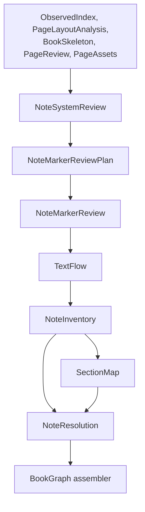

# Note Processing Before and After SectionMap

**Status:** Frozen contracts; implementation not started.

The exact schemas, dependency, validator, and 13-book acceptance boundaries are
frozen in
[BookGraph upstream artifact contracts](bookgraph-upstream-artifact-contracts.md).

## Decision

Inkline separates note-system discovery, visual marker recognition, TextFlow
materialization, note inventory, section assignment, and final reference resolution.
No downstream stage modifies an upstream artifact.

A book does not have one scalar note type. It may contain multiple simultaneous note
systems, including page-foot notes, chapter-end notes, and book-end notes. Each system
has its own definition region, marker style, reference scope, and reset policy.

Canonical v1's Qwen marker locator remains a behavioral reference. Its useful
capability moves behind parser-neutral review artifacts; the new canonical workflow
does not call MinerU-specific canonical repair code.

## Artifact Sequence



TextFlow is materialized once. NoteSystemReview and NoteMarkerReview operate on
observations, page/layout evidence, and page images; they do not create provisional
TextUnits.

## NoteSystemReview

NoteSystemReview identifies zero or more note systems:

```json
{
  "note_systems": [
    {
      "note_system_id": "ns000001",
      "kind": "chapter_endnote",
      "definition_ranges": [[23, 24]],
      "reference_scope": "chapter",
      "marker_styles": ["numeric"],
      "reset_policy": "chapter",
      "evidence_ids": ["nse000001"],
      "confidence": "high"
    }
  ],
  "unresolved_system_candidates": []
}
```

Its evidence comes from:

- page-foot definition lanes, separators, typography, and page-local repetition;
- Skeleton chapter boundaries and note-like regions between one chapter and the next;
- explicit headings such as `注`, `注释`, or `Notes`, interpreted together with
  physical position rather than by text alone;
- back-matter note regions and any chapter-group headings within them;
- marker sequence and reset patterns; and
- bounded multimodal review when structure remains ambiguous.

The artifact may record unresolved fields. It must not turn weak evidence into a
false chapter or book scope.

## NoteMarkerReviewPlan

The plan uses each note system's scope to select exact pages, observations, and image
crops for review. A raw count mismatch is only a trigger, not proof of an error.

For a page-foot system, the plan checks definition candidates and body-reference
candidates on the same physical page. For a chapter-end system, it checks definitions
against references inside the corresponding Skeleton chapter. For a book-end system,
it first respects chapter groupings or a global sequence declared by
NoteSystemReview.

The plan records reasons such as:

- `definition_marker_unreadable`;
- `definition_candidate_contains_multiple_markers`;
- `definition_marker_without_reference_candidate`;
- `reference_candidate_without_definition_marker`;
- `marker_sequence_gap`;
- `ambiguous_note_system`; or
- `parser_and_visual_evidence_conflict`.

Numeric gaps and unequal counts never authorize an automatic repair. One definition
may have multiple references, numbering may intentionally skip, one observation may
contain several definitions, and different systems may reuse the same marker.

## NoteMarkerReview

The bounded visual model recognizes two kinds of printed evidence:

- note-definition markers; and
- inline body-reference markers with enough adjacent text to locate them.

The output references existing pages and observations and includes page/crop bbox,
marker, adjacent text or quote, confidence, prompt/model version, and provenance.
It does not assign a section or final target note id.

Recognition results are validated conservatively:

- the marker belongs to the allowed style for the candidate note system;
- adjacent text anchors align with supplied observation text;
- a definition result lies inside the planned definition region;
- a body reference lies inside the planned body candidate;
- ambiguous or failed localization remains unresolved; and
- disabling or failing the model is distinguishable from proving that no marker
  exists.

## TextFlow and Inline Runs

TextFlow consumes validated marker evidence before assigning final `tu...` ids:

- complete page-foot, chapter-end, and book-end definition units become note-compatible
  TextUnits;
- same-note fragments are reconciled before final identity assignment;
- printed body references become `note_ref` inline runs; and
- every inserted run retains marker-review provenance.

At this point a run can be accurately located without yet having a target:

```json
{
  "type": "note_ref",
  "marker": "1",
  "text": "1",
  "source_page": 18,
  "target_note_id": null,
  "resolution_status": "unresolved",
  "evidence_ids": ["nmr000123"]
}
```

SectionMap does not insert or edit these runs.

## NoteInventory

NoteInventory is generated once from the final TextFlow and NoteSystemReview. It
contains:

- note-definition TextUnit ids and normalized markers;
- body-reference locations as `text_unit_id` plus inline-run index;
- note-group headings and definition ranges;
- the candidate note-system id for every definition and reference;
- marker coverage audits within the correct scope; and
- explicit unresolved, duplicate, orphan, and ambiguous cases.

NoteInventory may record deterministic same-page or same-scope candidates, but it
does not publish an authoritative target relation.

## SectionMap and NoteResolution

SectionMap consumes NoteInventory so chapter-end and book-end note groups are not
silently assigned to the preceding ordinary subsection. It assigns note definitions,
group headings, and physical pages to confirmed note sections or leaves them
standalone/unresolved.

NoteResolution then consumes NoteInventory and SectionMap. It emits a new immutable
relation artifact:

```json
{
  "reference_id": "nr000123",
  "source_text_unit_id": "tu000456",
  "source_inline_run_index": 3,
  "marker": "1",
  "target_note_unit_id": "tu001205",
  "note_system_id": "ns000001",
  "scope": "chapter",
  "resolution_status": "resolved",
  "decision_source": "unique_marker_within_confirmed_chapter_scope"
}
```

It does not mutate TextFlow, NoteInventory, or SectionMap. BookGraph assembly maps
TextUnit identities to BookGraph node identities, creates `references_note` edges,
and writes resolved target ids only into the assembled BookGraph copy.

## Acceptance

The 13-book corpus must cover:

1. page-foot definitions and inline references whose printed markers MinerU omitted;
2. a multi-paragraph note represented by one note TextUnit;
3. an explicit `接下页`/`接上页` continuation;
4. a definition observation that actually contains two independent marked notes;
5. chapter-end note groups between confirmed chapter boundaries;
6. a book-end note region, both globally numbered and grouped by chapter when samples
   exist;
7. a mixed book such as 《中日交流两千年》 with page-foot and chapter-end systems;
8. the same numeric marker reused by two systems without cross-linking;
9. model-disabled and model-failed runs reported as unresolved rather than absent;
10. no downstream mutation of `inline_runs` or upstream artifacts.

## Non-goals

- Semantic matching based primarily on note prose.
- Inventing missing marker text.
- Treating every `reference_text` observation as a note.
- Rebuilding TextFlow after SectionMap.
- Modifying inline runs inside SectionMap or NoteResolution.
- EPUB, RAG, or public BookGraph presentation.
