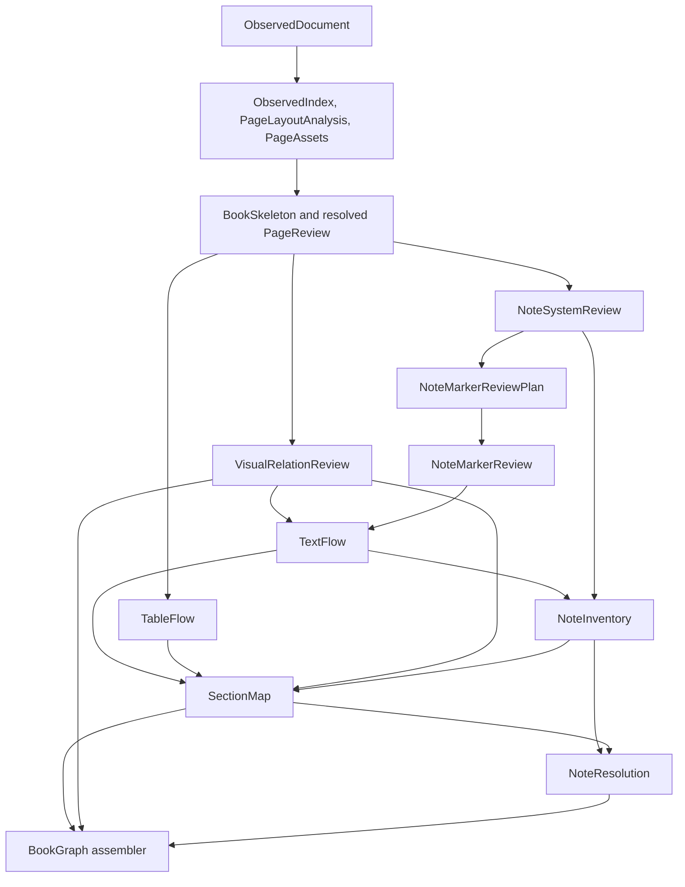

# SectionMap Upstream Replan

**Date:** 2026-07-31

**Status:** Approved dependency direction; implementation must be re-sliced before
SectionMap continues.

## Why the Plan Changed

Task 4 review exposed two classes of upstream defects that SectionMap cannot repair:

1. image and caption observations must form a validated visual group before TextFlow
   gives caption text its final type; and
2. note systems and visually omitted markers must be identified before TextFlow
   creates final note units and inline note references.

Continuing SectionMap first would encode known-wrong TextFlow types, note units, and
unowned visual or note regions. Fixing them later would either invalidate SectionMap
ids or require a downstream consumer to mutate upstream artifacts. Both violate the
materialized DAG contract.

The governing rule is:

> A stage may be incomplete and explicitly unresolved, but every fact it declares is
> correct. A downstream stage never repairs or mutates an upstream artifact.

## Revised Pre-Section Flow

The diagram shows execution order. The architecture I/O table remains authoritative
for exact fan-in.

## Current Branch Assessment

Snapshot at the time of replanning:

- main: `a9860fa`;
- branch: `codex/text-flow-layout-reconciliation`;
- branch HEAD: `6f651f9`;
- 34 commits ahead of main;
- committed diff: 36 files, about 8,131 insertions and 451 deletions;
- committed work is predominantly classification-before-aggregation, paragraph,
  display, and footnote reconciliation plus focused real-book tests;
- the worktree also contains a large uncommitted mixture of TableFlow, SectionMap,
  workflow, PageReview, adapter, test, and documentation changes.

The branch must not absorb VisualRelationReview and the note pipeline. It is already
too broad, and final TextFlow acceptance now depends on those missing inputs.

### Recommended disposition

1. Preserve every uncommitted change; do not reset or discard it.
2. Treat the 34 committed commits as a **TextFlow reconciliation foundation**, not
   final TextFlow acceptance.
3. Separate the uncommitted TableFlow work into its own branch after validating which
   parts remain compatible with the revised contracts.
4. Preserve the uncommitted SectionMap implementation as reference work, but do not
   merge it as an accepted SectionMap. Its input contract is obsolete because it lacks
   VisualRelationReview and NoteInventory.
5. Run the required gates on the committed TextFlow foundation. If clean, merge that
   bounded foundation back to main.
6. Start each new upstream artifact from the refreshed main in a small branch. Do not
   stack all remaining work on the current branch.

This means the current branch should end after foundation validation and extraction
of unrelated uncommitted work. It should not continue through Task 4.

## New Implementation Plan

Every step ends with focused tests, Ruff, Pylint, Pyright where type-sensitive, and
artifact comparison against the immediately preceding accepted 13-book outputs.
No named-book production hardcoding is allowed.

### Step 0 — Close the current branch safely

- inventory the committed and uncommitted changes by artifact owner;
- preserve uncommitted TableFlow and SectionMap work on dedicated branches or patches;
- validate the 34 committed TextFlow-foundation commits;
- merge only the validated foundation to main;
- do not declare the 13-book TextFlow frozen yet.

**Gate:** clean foundation branch, no lost work, exact commit and artifact handoff.

### Step 1 — Freeze the revised contracts

- add contracts and validators for `VisualRelationReview`, `NoteSystemReview`,
  `NoteMarkerReviewPlan`, `NoteMarkerReview`, `NoteInventory`, and
  `NoteResolution`;
- add `caption` to the TextFlow type contract;
- update `CanonicalArtifactBundle` dependencies;
- enforce immutable upstream inputs and new artifact outputs.

**Gate:** contract tests reject dangling ids, incompatible endpoint kinds, invented
markers, invalid scopes, and attempts to encode resolved targets without evidence.

### Step 2 — Implement VisualRelationReview

- build deterministic candidate selection from observed/layout evidence;
- add bounded same-page multimodal relation review;
- emit visual groups plus unpaired and unresolved endpoints;
- validate the 13-book visual audit, including body visuals rather than only
  PageReview visual pages.

**Gate:** accepted visual-group artifact; page 25 of 《丝绸之路新史》 is a mandatory
regression, not production hardcoding.

### Step 3 — Implement NoteSystemReview

- detect page-foot, chapter-end, book-end, and mixed note systems;
- identify definition ranges, reference scope, marker style, and reset policy;
- use Skeleton and physical layout without assigning final SectionMap membership;
- leave ambiguous systems unresolved.

**Gate:** 13-book note-system inventory with explicit mixed-mode coverage.

### Step 4 — Port marker recognition to NoteMarkerReview

- characterize canonical v1 Qwen behavior;
- move useful visual recognition behind parser-neutral plan and evidence contracts;
- recognize definition and body-reference markers without assigning target notes;
- cache and audit model inputs/results; distinguish absent, not-run, failed, and
  unresolved.

**Gate:** marker evidence comparison on known v1 cases plus model-disabled tests.

### Step 5 — Finalize TextFlow once

- consume VisualRelationReview and NoteMarkerReview;
- materialize captions as `caption`, complete note units, and unresolved `note_ref`
  inline runs;
- reuse the current branch's paragraph/display/footnote reconciliation foundation;
- assign final `tu...` ids once;
- regenerate and inspect all 13 TextFlows.

**Gate:** freeze TextFlow only after classification, aggregation, observation
coverage, inline runs, unconsumed evidence, and changed units are explained.

### Step 6 — Finalize TableFlow independently

- recover compatible uncommitted TableFlow work into its own branch;
- keep structured tables in text/table flow after PageReview;
- keep non-renderable visual tables excluded or unresolved;
- prevent split include/exclude candidates from becoming half-tables;
- define unambiguous ownership between table captions and visual captions.

**Gate:** every table observation is consumed, excluded, or unresolved across the
13-book corpus.

### Step 7 — Build NoteInventory

- inventory final note TextUnits, inline references, note groups, marker coverage,
  and unresolved cases;
- preserve NoteSystemReview and NoteMarkerReview provenance;
- do not resolve authoritative targets.

**Gate:** no dangling TextUnit/run references; mixed systems remain separated.

### Step 8 — Rebuild SectionMap

- update the contract to consume TextFlow, TableFlow, VisualRelationReview, and
  NoteInventory;
- assign text units, logical tables, visual groups, note groups, and physical pages;
- keep standalone and unresolved material explicit;
- reuse only compatible parts of the preserved Task 4 implementation.

**Gate:** automated 13-book membership/range/coverage comparison, followed by the
single requested Task 4 manual checkpoint.

### Step 9 — Implement NoteResolution

- resolve page, chapter, and book scopes from NoteInventory plus confirmed
  SectionMap;
- emit immutable reference relations;
- do not modify TextFlow inline runs or SectionMap.

**Gate:** unique evidence-based relations only; ambiguous and orphan cases remain
explicit.

### Step 10 — Assemble BookGraph later

- map validated artifact ids into BookGraph nodes and edges;
- project `caption_of`, `contains`, and `references_note`;
- write resolved target ids only into the assembled BookGraph copy;
- leave EPUB and RAG behavior to later scoped work.

## Branching Strategy

Use short-lived branches rooted from the latest validated main:

1. `codex/visual-relation-review`
2. `codex/note-system-review`
3. `codex/note-marker-review`
4. `codex/text-flow-finalization`
5. `codex/table-flow`
6. `codex/note-inventory`
7. `codex/section-map-v2`
8. `codex/note-resolution`

Contract-only changes shared by several stages should land first in a small
architecture/contracts branch. Later branches rebase or start from the updated main
rather than accumulating in one long-lived integration branch.
