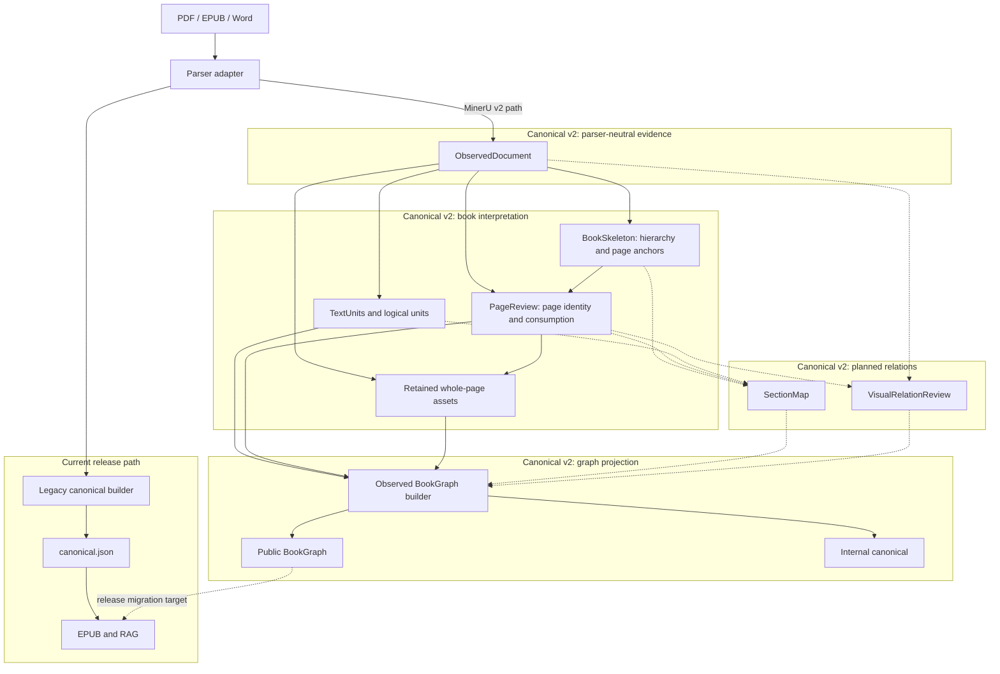
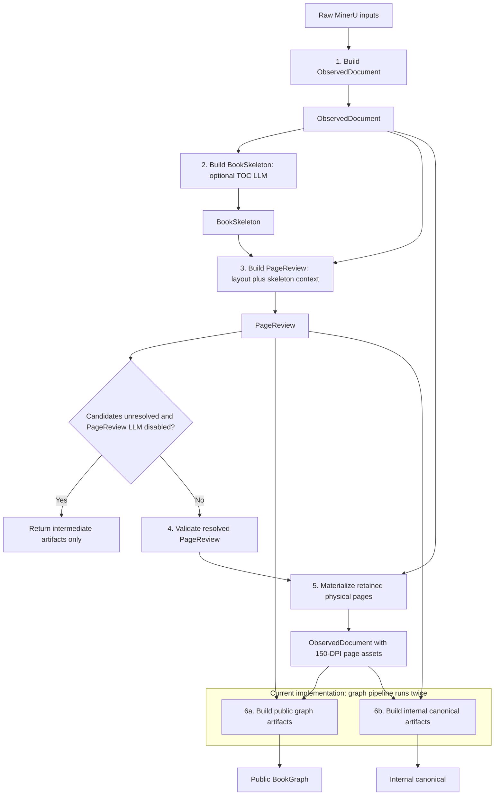

# Architecture Diagrams Redesign Implementation Plan

> **For agentic workers:** REQUIRED SUB-SKILL: Use superpowers:subagent-driven-development (recommended) or superpowers:executing-plans to implement this plan task-by-task. Steps use checkbox (`- [ ]`) syntax for tracking.

**Goal:** Replace both diagrams in `docs/architecture.md` with direct Mermaid flowcharts that clearly separate architectural layers from runtime artifact flow.

**Architecture:** The architecture diagram will group the release-v1 path and canonical-v2 layers by responsibility, with solid current dependencies and dashed planned dependencies. The runtime diagram will show builders, artifacts, the PageReview early-return decision, asset materialization, and duplicated public/internal construction as a top-to-bottom data flow.

**Tech Stack:** Markdown, Mermaid `flowchart`, shell-based documentation checks

## Global Constraints

- Use Mermaid `flowchart` syntax only.
- Do not use `sequenceDiagram`, participant call/return arrows, or HTML labels.
- Solid arrows represent implemented dependencies.
- Dashed arrows represent planned dependencies or migration targets only.
- Keep the current release-v1 path visible and separate from canonical v2.
- Preserve the PageReview early return and duplicated graph construction in the runtime diagram.

---

### Task 1: Replace Both Architecture Diagrams

**Files:**
- Modify: `docs/architecture.md`

**Interfaces:**
- Consumes: The current `build_v2_artifacts()` stage order and the diagram design in `docs/superpowers/specs/2026-07-23-architecture-diagrams-redesign-design.md`.
- Produces: Two Markdown-native Mermaid flowcharts: a layered dependency view and an artifact-driven runtime view.

- [ ] **Step 1: Run a characterization check that fails on the current runtime diagram**

Run:

```bash
if rg -q '^sequenceDiagram$|^[[:space:]]+participant ' docs/architecture.md; then
  echo 'FAIL: call-return sequence syntax remains'
  exit 1
fi
```

Expected: exit 1 with `FAIL: call-return sequence syntax remains`.

- [ ] **Step 2: Replace the Architecture Dependency Graph Mermaid block**

Use a top-to-bottom flowchart with these responsibility groups and edges:



Keep adjacent prose explicit that `SectionMap` and `VisualRelationReview` are not current runtime stages and that `materialize_v2_page_assets` renders whole physical pages only.

- [ ] **Step 3: Replace the Current Canonical-v2 Runtime Sequence Mermaid block**

Use a top-to-bottom artifact flow with builder nodes between inputs and outputs:



Update the surrounding prose so it describes artifact flow rather than orchestrator messages. State in prose that physical-page anchors are resolved against `ObservedDocument` evidence and that `SectionMap` and `VisualRelationReview` are absent from this runtime.

- [ ] **Step 4: Run focused Markdown and Mermaid checks**

Run:

```bash
test "$(rg -c '^```mermaid$' docs/architecture.md)" -eq 2
! rg -n '^sequenceDiagram$|^[[:space:]]+participant |<br[[:space:]]*/?>' docs/architecture.md
rg -n 'ObservedDocument.*BookSkeleton|BookSkeleton.*PageReview|Candidates unresolved|graph pipeline runs twice' docs/architecture.md
git diff --check
```

Expected: exit 0; exactly two Mermaid blocks; no sequence or HTML syntax; all four architecture/runtime facts found; no whitespace errors.

- [ ] **Step 5: Review the rendered source and commit**

Run:

```bash
git diff -- docs/architecture.md
git status --short
```

Expected: only `docs/architecture.md` is modified and both original diagram blocks are replaced without unrelated prose changes.

Commit:

```bash
git add docs/architecture.md
git commit -m "docs: clarify architecture and runtime diagrams"
```
