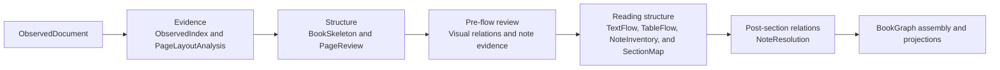

# inkline-canonical

`inkline-canonical` is the contract hub of inkline. Parser adapters write into
canonical contracts, EPUB/RAG/export code read from them, and shadow BookGraph
work evolves here before becoming the release canonical contract.

## Public Role

- Owns the current `CanonicalDocument` schema, validation, migration helpers,
  and JSON IO.
- Owns parser-neutral development contracts such as `ObservedDocument`,
  `BookSkeleton`, `PageLayoutAnalysis`, `PageReview`, `VisualRelationReview`,
  `NoteSystemReview`, `NoteMarkerReview`, `TextFlow`, `TableFlow`,
  `NoteInventory`, `SectionMap`, `NoteResolution`, `BookGraph`, and
  `internal_canonical`.
- Keeps parser-specific details out of public canonical fields. Parser payloads
  belong in provenance/debug payload fields.
- Does not parse PDFs, call MinerU, render EPUB, or build RAG indexes.

## Package Structure

```text
inkline/canonical/
  __init__.py              Public exports for stable callers.
  schema.py                Current canonical document schema and validation.
  io.py                    JSON read/write helpers for canonical artifacts.
  types.py                 Shared TypedDict-style legacy canonical types.
  source_map.py            Source/page/bbox mapping helpers.

  observed/                Parser-neutral ObservedDocument layer.
    schema.py              Observation, page, and document contracts.
    page_roles.py          Geometry-first page-role candidates.
    text_units.py          Current on-demand TextUnit construction; target moves to TextFlow.
    text_unit_layout.py    Current layout-profile and TextUnit audit helpers.

  page_layout/             Target reusable PageLayoutAnalysis artifact.
    contract.py            Parser-neutral page-layout development contract.
    builder.py             ObservedDocument geometry -> reusable page analysis.
    validation.py          Page-layout contract and provenance validation.

  book_skeleton/           TOC-driven book skeleton layer.
    contract.py            Skeleton schema and role contracts.
    toc.py                 TOC entry extraction and normalization.
    toc_llm.py             LLM TOC JSON contract, prompt, and validation.
    pages.py               Physical-page localization from observed titles.
    builder.py             Skeleton assembly from ObservedDocument evidence.
    validation.py          Skeleton contract validation.

  page_review/             Bounded multimodal page-review layer.
    selection.py            Geometry and skeleton evidence -> review candidates.
    llm.py                  Strict LLM decision prompt and profile selection.
    resolution.py           Decision validation and resolved-review contract.

  visual_relations/        Image/figure/plate to caption review before TextFlow.
    contract.py             Visual groups plus unpaired/unresolved endpoints.
    builder.py              Observed/layout/page evidence -> bounded relation review.
    validation.py           Endpoint identity, ownership, and provenance checks.

  note_system/             Page/chapter/book and mixed note-system review.
  note_marker_review/      Bounded definition/body marker recognition evidence.

  text_flow/               Target single TextFlow/TextUnit artifact.
    contract.py            TextFlow and TextUnit development contract.
    builder.py             Reviewed observed/layout evidence -> final TextFlow.
    validation.py          Unit ordering, boundary, and provenance validation.

  table_flow/              Parser-neutral structured-table artifact.
    contract.py            TableFlow and logical-table development contract.
    builder.py             Observed + index + resolved PageReview -> TableFlow.
    validation.py          Table consumption, ordering, and provenance validation.

  section_map/             Section membership and physical-page placement.
    contract.py            SectionMap development contract.
    builder.py             Validated upstream structure -> SectionMap.
    validation.py          Contract and cross-source validation.

  note_inventory/          Final notes, inline references, groups, and gaps.
  note_resolution/         Immutable resolved reference relations after SectionMap.

  artifact_dag/            Artifact bundle contracts shared with orchestration.
    artifacts.py           Immutable canonical artifact bundle types.

  bookgraph/               BookGraph v2 shadow layer.
    schema.py              Public BookGraph node/edge/evidence contract.
    from_observed.py       ObservedDocument -> BookGraph builder.
    notes.py               Note/reference relation helpers.
    projection.py          BookGraph -> legacy block projection bridge.
    audit.py               Projection and structure audit helpers.
    internal.py            Internal audit artifact with debug provenance.
    footnote_text.py       Footnote text normalization utilities.
```

The target development data flow is an explicit materialized DAG. The compact view
shows stage order; exact fan-in remains explicit in the architecture I/O table.



`ObservedDocument`, `BookSkeleton`, `PageLayoutAnalysis`, `PageReview`, `TextFlow`,
`TableFlow`, the review/relation artifacts, `NoteInventory`, `SectionMap`, `BookGraph`,
and `internal_canonical` are pre-release development artifacts. Each has a validator
and may be materialized independently by the planned `inkline-workflow` layer for
golden review, resume, or debugging. Builders do not choose output paths and do not
mutate upstream artifacts.

The target workflow builds one final TextFlow after validated visual groups, note
systems, and marker evidence exist. TextFlow's ordered TextUnits are authoritative;
current paragraph logical-splitting behavior moves into TextFlow before final `tu...`
ids are assigned rather than creating a second `lu...` namespace. SectionMap consumes
that TextFlow together with TableFlow, VisualRelationReview, and NoteInventory. The
current runtime has not yet reached this revised target, and release BookGraph,
internal-canonical, EPUB, and RAG projections have not been switched to it.

During pre-release development, temporary schema versions such as `0.1-shadow` may
change incompatibly. Do not add migration or backward-compatibility code for superseded
shadow artifacts; regenerate them and their goldens. Freeze one release schema version
before the first release, then handle future migrations only at release boundaries.

`inkline-canonical` owns domain contracts, builders, validators, and the immutable
artifact-bundle contract. It does not own execution order. The planned
`inkline-workflow` package consumes those APIs and provides a deterministic scheduler,
artifact store, and resume policy. A future LangChain/LangGraph adapter may invoke the
same workflow stages without introducing agent-framework dependencies into canonical
builders.

`BookSkeleton` schema `0.2-shadow` records a `selected_start_anchor` exactly
when `selected_start_page` is non-null. Its exact fields are `anchor_id`,
`page`, `resolution_method`, `printed_page_offset`, `title_observation_ids`,
`toc_observation_ids`, `supporting_anchor_ids`, and `confidence`.
`observed_title_match` is direct and `high` confidence; `printed_page_offset`
is `medium` confidence and has exactly two straddling direct anchors that agree
on the offset. A selected start anchor proves where a section starts and why.
It does not prove that later pages or resources belong to that section.

The internal `SectionMap` consumes `BookSkeleton`, resolved `PageReview`, the single
validated `TextFlow`, validated `TableFlow`, `VisualRelationReview`, and
`NoteInventory`. It assigns already-classified units, logical tables, visual groups,
and note groups to sections; it does not classify paragraphs, repair invalid TextUnit
boundaries, discover image-caption relations, resolve note targets, or reinterpret
unresolved table candidates. For
`observed_title_match`, it maps `title_observation_ids` to exact TextFlow units. For
`printed_page_offset`, whose title evidence is empty, it uses the
validated physical `page`, matching `toc_observation_ids`, and two agreeing
direct `supporting_anchor_ids`; it does not fabricate a title TextUnit or
rediscover a heading. SectionMap still owns membership and ranges, may leave an
offset-backed placement unresolved, and must preserve both `standalone` and
`unresolved` physical pages instead of assigning them to the nearest preceding
TOC title. Only confirmed membership becomes BookGraph `contains` edges and
later RAG heading-path context.

The SectionMap business builder should not require the full ObservedDocument. A
separate cross-source validator consumes `ObservedIndex` to prove that referenced
observations, pages, assets, and provenance exist. ObservedDocument is used once to
construct that index upstream and is not passed into SectionMap. This keeps raw
evidence auditing separate from section-assignment decisions.

The detailed target contracts are in
[VisualRelationReview before TextFlow](../../docs/visual-relation-review-design.md),
[note processing before and after SectionMap](../../docs/note-processing-design.md),
and [the SectionMap upstream replan](../../docs/section-map-upstream-replan.md).

## TOC LLM Boundary

The preferred TOC path is to let the LLM read the TOC visual structure and emit
public TOC entries: `display_title`, `level`, `parent_entry_index`, and `role`.
The prompt must define each field explicitly, including that `level` starts at 1
and `role` is limited to `front_matter`, `body`, `back_matter`, or `unknown`.
The TOC LLM may emit only TOC-structure fields; it must not emit physical
pages, start anchors, printed-page offsets, or observation ids.

Code should not patch LLM-capable structure after the fact. If the model can
infer a field from the TOC image, improve the prompt/schema/examples first.
Deterministic code is responsible for validation and for facts outside the
LLM's evidence, especially `candidate_start_pages`, `selected_start_page`, and
`selected_start_anchor`, which are derived from ObservedDocument physical page
and TOC evidence. The TOC LLM emits neither anchors nor anchor evidence.

Public BookSkeleton TOC entries intentionally do not expose split
`raw_title`/`title`/`raw_label`/`label` fields. Internal builders may derive
temporary locator candidates from `display_title`, but those helpers are not
part of the public skeleton contract.

## PageReview Boundary

`PageReview` is an internal Phase 4A artifact. Its `page_role` has exactly two
reading-flow values: `text_flow_page` and `visual_page`. A map, image, diagram,
or table is evidence about a page, not a third reading-flow role. A page with
independent body paragraphs is `text_flow_page`; a page containing only visual
material, captions, or labels is `visual_page`.

Optional `special_page_kind` records a separate semantic identity such as
`front_exterior_page`, `back_exterior_page`, `cover_flap`, `dust_jacket_spread`,
`title_page`, `decorative_preliminary_page`, `decorative_title_page`, `dedication_page`, `acknowledgments_page`,
`copyright_page`, `toc_page`, `blank_page`, `epigraph_page`, `plate_page`,
`chronology_chart_page`, or `genealogy_chart_page`.
It
does not replace `page_role`. Resolved `visual_page` decisions cannot use
`text_flow_action = include`, which prevents image/caption OCR from silently
becoming reading-flow nodes. `visual_asset_action` independently controls
whether the rendered page image is retained for provenance and EPUB fidelity.
For `copyright_page`, PageReview deterministically uses `visual_page`,
`front_matter`, `metadata_only`, and `retain`: its text remains evidence for
later document-level metadata extraction, not reading-flow OCR or RAG chunks.
An `acknowledgments_page` is distinct from a dedication leaf: it remains
front-matter reading flow (`text_flow_page + include + not_needed`).

`chronology_chart_page` is a date-organized timeline or event chart;
`genealogy_chart_page` is a hierarchy of named people or dynasties connected by
parent-child, lineage, or generational branches. Date ranges attached to people
do not change a genealogy into a chronology. Both are retained as
`visual_page + exclude + retain` until later structured extraction stages.

External-wrap identities record only what a PDF page can establish:
`front_exterior_page` and `back_exterior_page` are the book's observable outer
front and rear surfaces, without guessing whether they are paperback covers or
hardcover boards. `dust_jacket_spread` is a flattened full jacket with its
panels and spine. All external-wrap identities normalize to
`visual_page + exclude + retain`.

`dust_jacket_spread` has a strict four-part definition: one physical PDF page
must visibly contain the front-cover design, back-cover design, book spine, and
at least one jacket flap, separated by folds or panel boundaries. It is never
inferred from neighboring pages. A standalone front outer surface is
`front_exterior_page`, and a standalone rear panel is `back_exterior_page`,
even when it contains a barcode, QR code, ISBN, price, or publisher blurb.

`decorative_preliminary_page` is a patterned or texture-only book-internal
preliminary leaf. It does not claim a physical binding term such as
`front_endpaper`, which requires evidence beyond a single page image.
`decorative_title_page` is an ornamental title leaf distinct from the
bibliographic `title_page`. Both normalize to
`front_matter + visual_page + exclude + retain`.

`epigraph_page` is a front-matter leaf containing a standalone opening
quotation, maxim, or attribution; `plate_page` is a page principally occupied
by a printed illustration, photograph, map, artwork, or facsimile, with at
most its plate number, caption, or labels. `plate_page` can occur in any book
position and does not imply a cross-page `plate_section`. Both identities use
`visual_page + exclude + retain` so their OCR does not enter reading flow while
their rendered page remains available for EPUB fidelity and later asset work.
PageReview does not associate an image with its caption. `VisualRelationReview`
consumes resolved page decisions, PageAssets, and existing observation ids before
TextFlow materializes caption TextUnits. It covers selected body image/caption
candidates as well as retained visual pages. SectionMap later assigns the already
validated visual group; it never creates `caption_of`.

`book_block_position` records the physical book position separately from the
reading-flow role: `external_wrap`, `front_matter`, `body`, `back_matter`, or
`unknown`. Before the first Skeleton body page, PageReview uses the provisional
internal context `pre_body`; it does not assume those pages are front matter. It
consumes `selected_start_page` and remains independent of
`selected_start_anchor` provenance. It does deterministically materialize
`front_matter` for pages covered by a localized Skeleton front-matter section
and for `toc_page`. PageReview then closes the remaining pre-body `unknown`
pages with a bounded second LLM pass, so ordinary internal front prose does not
silently remain unresolved.

The LLM can identify an outer cover, back cover, or cover flap as
`external_wrap`. A book without those pages simply produces no such decision.

The current LLM scope is deliberately limited to `pre_body`. It runs in two
stages: selected visual candidates first, then every remaining pre-body page
whose `book_block_position` is still `unknown`. Body and back-matter pages
retain geometry and Skeleton decisions with `llm_review_status = not_selected`;
they are not rendered or sent to the model, and never retain a `needs_review`
consumption action.

The multimodal review prompt has a small common contract plus exactly one
evidence-selected profile per physical-page request: `front_special`,
`front_visual_identity`, `after_front_exterior`, `after_title_page`,
`after_decorative_preliminary`, `front_residual_unknown`,
`body_section_start`, `visual_sparse_text`, `mixed_visual_body`,
`textual_table`, or `general`. PageReview supplies one rendered physical page
per request, avoiding visual inference from neighboring-page imagery. Sequence
profiles receive only the preceding resolved identity, never its image. When a
page could equally be exterior artwork or an internal plate, PageReview leaves
`special_page_kind` empty and `book_block_position` as `unknown`, rather than
inventing a binding identity. A reviewed page records its `llm_prompt_profile`,
while the top-level `llm` record stores the model and prompt version.

`table_region` always selects `textual_table`: a readable table and a table
continuation remain in reading flow even when they fill an entire page. This profile
takes precedence over terminal-page routing. `TableFlow` runs only after these
PageReview decisions: fully excluded table candidates remain excluded, while a
multi-page candidate split between included and excluded pages remains unresolved
instead of becoming a partial table.

## Maintenance Guardrail

Avoid growing `inkline.canonical` back into a large flat namespace. If a package
grows beyond 10 top-level modules, evaluate whether related modules should
become a subpackage with a small public facade.
`tests/test_canonical_package_structure.py` enforces this for
`inkline.canonical`; if Ruff or Pylint gains a native package-module-count rule,
enable it there as well.
